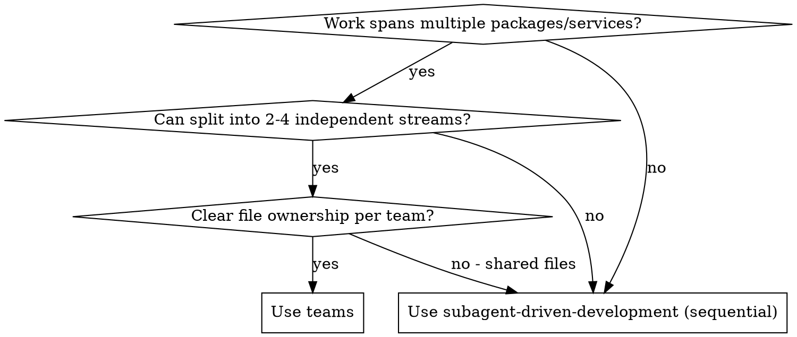

# Parallel Teams

Run 2-4 implementation teams concurrently using git worktrees + Task tool subagents. Each team gets an isolated worktree, implements from a shared plan, gets reviewed, and merges sequentially.

**Core principle:** Worktree isolation + parallel subagents + sequential merge = safe concurrent development.

## When to Use



## Checklist

Create as TaskCreate items (one per phase):

1. **Design** - Write team-structured design doc (`docs/plans/YYYY-MM-DD-<topic>-design.md`)
2. **Plan** - Write per-team implementation plan (`docs/plans/YYYY-MM-DD-<topic>-implementation.md`)
3. **Worktrees** - Create worktrees + install deps in each
4. **Parallel Build** - Dispatch build agents (one per team, all in one message)
5. **Review & Fix** - Dispatch review agents, then fix agents for Critical/Important findings
6. **Merge & Deploy** - Sequential merge, integration test, deploy, cleanup

## Phase Reference

| Phase | Action | Output | Composes |
|-------|--------|--------|----------|
| 1. Design | Divide work into teams with clear boundaries | `docs/plans/*-design.md` | `superpowers:brainstorming` |
| 2. Plan | Convert design into tasks with exact code + paths | `docs/plans/*-implementation.md` | `superpowers:writing-plans` |
| 3. Worktrees | `git worktree add .worktrees/<slug> -b feat/<name> main` + install | Worktrees ready, deps installed | `superpowers:using-git-worktrees` |
| 4. Build | Dispatch `./team-implementer-prompt.md` per team | Commits on each branch | Task tool, model=sonnet |
| 5. Review | Dispatch `./team-reviewer-prompt.md`, then `./team-fixer-prompt.md` | Review findings + fixes | Task tool, model=sonnet |
| 6. Merge | Push, PR, merge sequentially; integration test; deploy; cleanup | PRs merged, deployed | `superpowers:finishing-a-development-branch` |

## Team Boundary Guidelines

| Good Split | Why |
|-----------|-----|
| Backend API vs. UI pages | Different packages, different file trees |
| New service vs. infrastructure | New files vs. config changes |
| Test suite vs. feature code | Test files rarely conflict with source |

| Bad Split | Why |
|----------|-----|
| Two teams editing the same file | Guaranteed merge conflicts |
| Shared types team + consumer team | Consumer blocks on types being done |

When overlap is unavoidable (e.g., both teams add to a shared `types.ts`), merge the types provider first and rebase the consumer.

## Merge Order

1. Dependency provider merges first (shared types before consumers)
2. Infrastructure before dependents
3. If no dependencies, smallest diff first (fewer conflict surfaces)
4. Always run integration test on main after each merge

```bash
# Pattern: merge team-one first
cd .worktrees/team-one && git push -u origin feat/team-one
gh pr create --title "feat: Team One" --body "..."
gh pr merge <number> --merge --admin

# Pull merged main
cd /project/root && git pull origin main

# Rebase team-two on updated main
cd .worktrees/team-two && git fetch origin main && git rebase origin/main
git push -u origin feat/team-two --force-with-lease
gh pr create --title "feat: Team Two" --body "..."
gh pr merge <number> --merge --admin

# Integration test
cd /project/root && git pull origin main
pnpm install && pnpm -r build && pnpm -r test
```

## Red Flags

**Never:**
- More than 4 teams per wave (merge conflicts dominate; split into waves instead)
- Skip code review (always review before merge)
- Use relative paths in subagent prompts (subagents have zero project context)
- Skip `pnpm install` in worktrees (builds will fail)
- Dispatch build agents sequentially (dispatch all in one message for concurrency)
- Skip integration test after merging all branches

**Always:**
- Use absolute paths in all subagent prompts
- Build after every task within a team
- Commit after every task within a team
- Run integration test on main after all merges complete

## Model Selection

| Agent Type | Model | Why |
|-----------|-------|-----|
| Build (well-specified plan) | sonnet | 3-5x faster, plan provides complete code |
| Build (architectural work) | opus | Requires judgment, novel design |
| Review | sonnet | Checklist-driven, well-defined criteria |
| Fix | sonnet | Specific findings, targeted changes |

## Scaling

| Scope | Teams | Tasks/Team | Typical Duration |
|-------|-------|-----------|-----------------|
| Small feature | 2 | 3-5 | 5-10 minutes |
| Medium feature set | 3 | 5-8 | 10-20 minutes |
| Large architecture | 4 | 8-15 | 20-40 minutes |

Above 4 teams, split into sequential waves instead.

## Prompt Templates

- `./team-implementer-prompt.md` - Dispatch one per team (Phase 4)
- `./team-reviewer-prompt.md` - Dispatch one per branch (Phase 5, first pass)
- `./team-fixer-prompt.md` - Dispatch for branches with Critical/Important findings (Phase 5, second pass)

## Integration

**Composes with:**
- **superpowers:brainstorming** - Phase 1 design exploration
- **superpowers:writing-plans** - Phase 2 implementation planning
- **superpowers:using-git-worktrees** - Phase 3 worktree creation
- **superpowers:finishing-a-development-branch** - Phase 6 merge/PR/cleanup

**Does NOT replace:**
- **superpowers:subagent-driven-development** - Use for sequential single-branch execution
- **superpowers:writing-plans** - Teams skill composes with it, doesn't replace it
