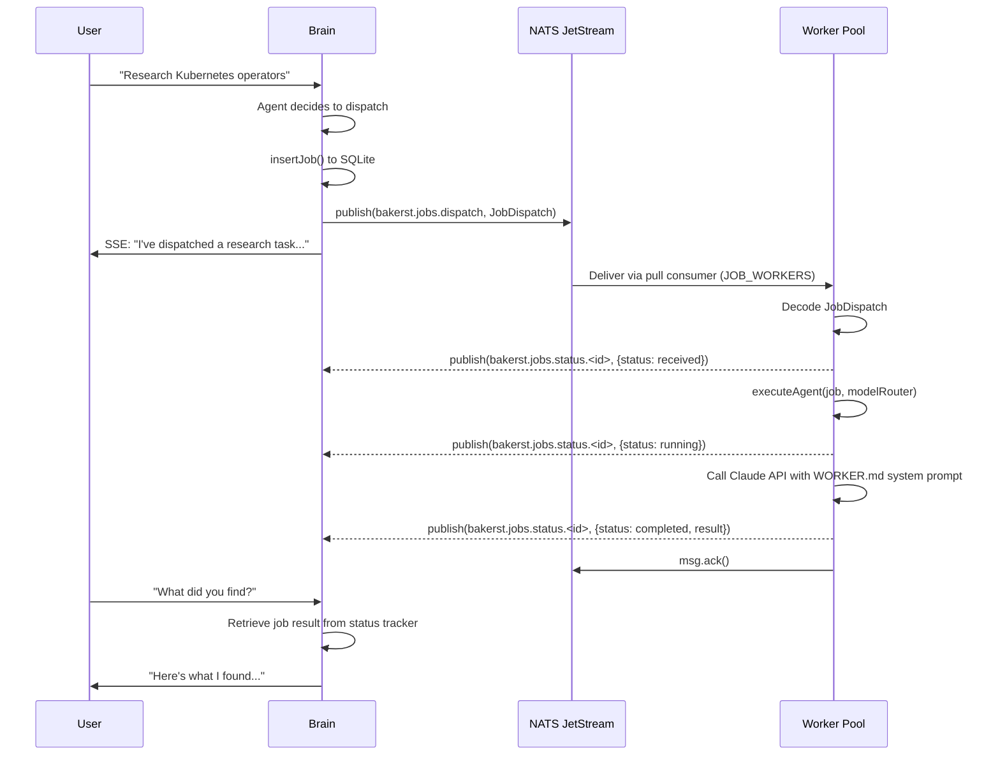
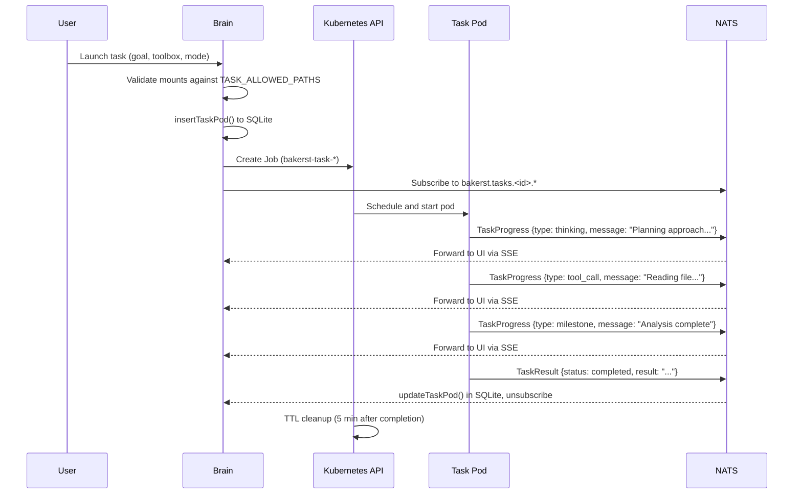

# Brain, NATS & Workers — Architecture Summary

This document explains the three core runtime components of Baker Street: the **Brain** (orchestrator), **NATS JetStream** (message bus), and **Workers** (both stateful pool workers and ephemeral task pods).

---

## Overview

```
┌─────────────┐     REST/SSE      ┌─────────────┐
│  UI / Gateway│ ───────────────▶ │    Brain     │
└─────────────┘                   │ (orchestrator)│
                                  └──────┬───────┘
                                         │
                          ┌──────────────┼──────────────┐
                          │              │              │
                          ▼              ▼              ▼
                    ┌──────────┐  ┌──────────┐  ┌──────────────┐
                    │   NATS   │  │  Qdrant  │  │ Claude API   │
                    │ JetStream│  │ (vectors)│  │ (LLM calls)  │
                    └────┬─────┘  └──────────┘  └──────────────┘
                         │
              ┌──────────┼──────────┐
              ▼                     ▼
       ┌─────────────┐      ┌─────────────┐
       │   Worker     │      │  Task Pod   │
       │  (stateful)  │      │ (ephemeral) │
       └─────────────┘      └─────────────┘
```

The Brain decides **what** to do; NATS delivers the work; Workers and Task Pods **execute** it.

---

## 1. The Brain Pod

**Source:** `services/brain/` | **K8s manifest:** `k8s/brain/`

The Brain is the central orchestrator — the "thinking" layer of Baker Street. It is a stateful, long-running Express.js service that maintains conversations, reasons with an LLM, dispatches background work, and manages the entire agent lifecycle.

### Responsibilities

| Area | What it does |
|------|-------------|
| **Conversation agent** | Multi-turn chat with Claude, iterative tool use (up to 10 rounds per turn), streaming SSE responses |
| **Job dispatch** | Publishes `JobDispatch` messages to NATS JetStream for worker execution |
| **Job tracking** | Subscribes to `bakerst.jobs.status.<jobId>` to receive real-time worker status updates |
| **Task pod management** | Creates ephemeral K8s Jobs via the Kubernetes API, tracks progress over NATS |
| **Memory (RAG)** | Stores/retrieves long-term memories in Qdrant using Voyage AI embeddings |
| **Skill/plugin system** | Manages MCP connections (Tier 0-3), legacy plugins, extension discovery |
| **Extensions** | Discovers pod-based extensions via NATS announce/heartbeat, connects over MCP HTTP |
| **Companions** | Manages distributed agent daemons on bare-metal/VM hosts outside K8s |
| **Scheduling** | Cron-based recurring job dispatch |
| **Model routing** | Multi-model support with role-based routing (agent, observer, worker) and fallback chains |
| **Auth** | Bearer token validation on all API routes (except `/ping`) |
| **Blue-green deploys** | Transfer protocol for zero-downtime upgrades between blue/green slots |

### Key Modules

| File | Purpose |
|------|---------|
| `index.ts` | Bootstrap — wires NATS, JetStream, SQLite, model router, all managers |
| `agent.ts` | Core reasoning loop — LLM calls, tool execution, conversation management |
| `api.ts` | Express routes — chat, jobs, tasks, memory, skills, health |
| `dispatcher.ts` | Publishes `JobDispatch` to JetStream with idempotent message IDs |
| `status-tracker.ts` | Subscribes to job status updates from workers |
| `task-pod-manager.ts` | Creates K8s Jobs for ephemeral task pods, validates mount paths |
| `extension-manager.ts` | Discovers extensions via NATS announce, manages MCP connections |
| `companion-manager.ts` | Manages remote companion agents |
| `mcp-client.ts` | MCP client with session recovery (reconnects on stale sessions) |
| `skill-registry.ts` | Database-backed skill management (Tier 0-3) |
| `brain-state.ts` | State machine: `pending → active → draining → shutdown` |
| `transfer.ts` | Blue-green handoff protocol over NATS |
| `db.ts` | SQLite for conversations, jobs, schedules, skills, API audit |

### Deployment

- **Blue-green:** Two deployments (`brain-blue`, `brain-green`), one active at a time
- **Service account:** `brain` — scoped RBAC for creating Jobs and reading its own secret
- **Replicas:** 1 per slot (singleton — owns SQLite state)
- **Volumes:** `hostPath` for persistent data (`/data`), ConfigMap for personality files (`/etc/bakerst`), `emptyDir` for `/tmp`
- **Resources:** 128Mi–256Mi memory, 100m–500m CPU
- **Probes:** Readiness and liveness on `/ping` (port 3000)

### NATS Connections

| Direction | Subject | Purpose |
|-----------|---------|---------|
| **Publish** | `bakerst.jobs.dispatch` | Dispatch jobs to worker pool (via JetStream) |
| **Publish** | `bakerst.heartbeat.brain` | 30-second heartbeat |
| **Subscribe** | `bakerst.jobs.status.<jobId>` | Receive worker status updates |
| **Subscribe** | `bakerst.tasks.<taskId>.progress` | Stream task pod progress |
| **Subscribe** | `bakerst.tasks.<taskId>.result` | Receive task pod results |
| **Subscribe** | `bakerst.extensions.announce` | Discover new extensions |
| **Subscribe** | `bakerst.extensions.<id>.heartbeat` | Monitor extension health |
| **Subscribe** | `bakerst.companions.announce` | Discover companions |
| **Subscribe** | `bakerst.companions.<id>.heartbeat` | Monitor companion health |
| **Pub/Sub** | `bakerst.brain.transfer.*` | Blue-green upgrade handoff |

---

## 2. NATS JetStream (Message Bus)

**Image:** `nats:2.10-alpine` | **K8s manifest:** `k8s/nats/`

NATS serves as the central nervous system connecting all Baker Street components. It provides both fire-and-forget pub/sub (for heartbeats, status updates, announcements) and durable JetStream delivery (for job dispatch).

### Why NATS

- **Lightweight:** Single binary, minimal resource footprint (128–256Mi)
- **Queue groups:** Free load balancing across worker replicas
- **JetStream:** Durable message delivery with acknowledgment, redelivery, and dead-letter handling
- **Subject hierarchy:** Clean topic routing (`bakerst.jobs.*`, `bakerst.tasks.*`, `bakerst.companions.*`)

### Configuration

```
listen: 0.0.0.0:4222

jetstream {
  store_dir: /data/jetstream
  max_mem: 128M
  max_file: 512M
}
```

- **Port:** 4222 (client connections)
- **Storage:** `emptyDir` with 512Mi size limit (ephemeral — acceptable because JetStream is used for in-flight work, not permanent storage)
- **No authentication** (cluster-internal, protected by NetworkPolicy)

### JetStream Resources

| Resource | Name | Purpose |
|----------|------|---------|
| **Stream** | `BAKERST_JOBS` | Captures messages on `bakerst.jobs.dispatch` |
| **Consumer** | `JOB_WORKERS` | Pull-based, durable consumer for worker pods |

The Brain creates the stream and consumer on startup (`ensureStream` / `ensureConsumer`), making the setup self-healing — if NATS restarts with empty storage, the Brain recreates everything on its next boot.

### Consumer Configuration

| Setting | Value | Purpose |
|---------|-------|---------|
| `ackWait` | 60 seconds | Time a worker has to acknowledge before redelivery |
| `maxDeliver` | 3 | Maximum delivery attempts before dead-letter |

### Message Flow Patterns

**Pattern 1 — Durable delivery (JetStream):**
Used for job dispatch where delivery guarantees matter.

```
Brain → JetStream publish → Stream stores → Consumer delivers → Worker pulls → Worker acks
```

**Pattern 2 — Fire-and-forget (Core NATS):**
Used for heartbeats, status updates, and announcements where occasional loss is acceptable.

```
Worker → publish(bakerst.jobs.status.<id>) → Brain subscription
```

**Pattern 3 — Request scoped (Core NATS):**
Used for task pods and companions where the Brain subscribes to a specific task ID.

```
Brain subscribes to bakerst.tasks.<taskId>.* → Task Pod publishes progress/result → Brain receives
```

### Network Policy

NATS is sealed — only these pods can connect:
- Brain
- Worker
- Extension pods (egress only)
- Task pods (egress only, port 4222 exclusively)

---

## 3. Workers

Baker Street has two distinct worker types that execute dispatched work: **stateful pool workers** (long-running Deployment pods) and **ephemeral task pods** (on-demand K8s Jobs).

### 3a. Stateful Worker Pool

**Source:** `services/worker/` | **K8s manifest:** `k8s/worker/`

Stateful workers are long-running pods that form a persistent worker pool. They pull jobs from NATS JetStream and execute them immediately.

#### How They Work

1. Worker starts, generates a unique ID (`worker-<uuid8>`)
2. Connects to NATS, obtains a reference to the `JOB_WORKERS` pull consumer
3. Calls `consumer.consume()` — a long-lived pull loop that fetches messages as they arrive
4. For each message, decodes the `JobDispatch`, runs the job, publishes status updates
5. On success: `msg.ack()` — message removed from stream
6. On failure: `msg.nak(5000)` — message redelivered after 5 seconds (up to 3 attempts)

#### Job Types

| Type | Handler | What it does |
|------|---------|-------------|
| `agent` | `executeAgent()` | Sends the job description to Claude with the worker's system prompt (SOUL.md + WORKER.md). Uses the `worker` model role if configured, otherwise falls back to `agent`. Single-turn, no tool use. |
| `command` | `executeCommand()` | Runs a shell command via `execFile`. Binary must be on the allowlist (`kubectl`, `curl`, `ls`, etc.). 30-second timeout. Blocks dangerous env vars (PATH, API keys). |
| `http` | `executeHttp()` | Makes an HTTP request (GET/POST/etc.). Validates URL scheme (http/https only). Returns status code + truncated body. |

#### Status Lifecycle

Each job publishes status updates on `bakerst.jobs.status.<jobId>`:

```
received → running → completed | failed
```

The Brain's `statusTracker` subscribes to these and updates the UI in real time.

#### Scaling

Workers scale horizontally — add replicas and NATS queue groups automatically load-balance across them. Each worker is stateless; all state lives in the Brain's SQLite and NATS.

#### Security

- **Zero inbound access** — workers have no ingress; they pull work exclusively from NATS
- **Command allowlisting** — only pre-approved binaries can execute
- **Blocked env vars** — `PATH`, `LD_PRELOAD`, `ANTHROPIC_API_KEY`, `AUTH_TOKEN` cannot be overridden
- **Read-only filesystem** — writable only at `/tmp`
- **Non-root, capabilities dropped, seccomp enabled**

#### Deployment Details

- **Replicas:** 1 (scalable)
- **Health probe:** HTTP `/healthz` on port 3001 (checks NATS connection liveness)
- **Heartbeat:** Publishes to `bakerst.heartbeat.worker.<workerId>` every 30 seconds
- **Resources:** 128Mi–256Mi memory, 100m–500m CPU
- **Secrets:** `bakerst-worker-secrets` — only ANTHROPIC_API_KEY, DEFAULT_MODEL, OPENAI_API_KEY, OLLAMA_ENDPOINTS, AGENT_NAME (no auth token, no gateway secrets)

### 3b. Ephemeral Task Pods

**Source:** `services/brain/src/task-pod-manager.ts` | **K8s manifest:** `k8s/task/` (RBAC only)

Task pods are on-demand Kubernetes Jobs that the Brain creates for isolated, goal-oriented work. Unlike stateful workers that process a queue of short jobs, task pods run a single long-running task and are destroyed when done.

#### How They Work

1. Brain receives a task request (goal, toolbox image, mode, optional mounts)
2. `TaskPodManager` validates mount paths against `TASK_ALLOWED_PATHS` allowlist
3. Creates a K8s Job (`bakerst-task-<uuid8>`) via the Kubernetes API
4. Subscribes to `bakerst.tasks.<taskId>.progress` and `bakerst.tasks.<taskId>.result`
5. Task pod runs, streams progress events over NATS
6. On completion, publishes `TaskResult` — Brain updates SQLite, unsubscribes
7. K8s TTL controller auto-deletes the Job after 5 minutes

#### Execution Modes

| Mode | Description |
|------|-------------|
| **Agent** | Full autonomous reasoning loop with tools — the toolbox image runs an AI agent that works toward the goal |
| **Script** | Runs a shell command/script inline, streaming stdout as progress events |

#### Task Progress Events

Task pods publish structured progress on `bakerst.tasks.<taskId>.progress`:

| Type | Purpose |
|------|---------|
| `log` | General log output |
| `tool_call` | Tool invocation by the agent |
| `thinking` | Agent reasoning/planning steps |
| `milestone` | Significant progress markers |

#### Key Differences from Stateful Workers

| | Stateful Workers | Ephemeral Task Pods |
|---|---|---|
| **Lifecycle** | Long-running (Deployment) | Created per-task, destroyed after (Job) |
| **Work source** | Pull from JetStream queue | Single goal assigned at creation |
| **Duration** | Seconds to minutes per job | Up to 30 minutes per task |
| **Capabilities** | Agent/command/HTTP (simple) | Full toolbox with host mounts |
| **Scaling** | Horizontal replicas | One pod per task, on demand |
| **State** | Stateless (all state in Brain) | Self-contained, isolated |
| **Tool access** | No tools (single LLM call) | Full tool suite in toolbox image |
| **Network** | Can reach NATS and brain | NATS only (zero ingress, restricted egress) |
| **Resource limits** | 256Mi / 500m CPU | 512Mi / 500m CPU |
| **Cleanup** | Manual (scale down) | Auto (TTL 5 min, deadline 30 min) |
| **Feature flag** | Always on | `FEATURE_TASK_PODS=true` |

#### Security (Strictest in the System)

| Control | Value |
|---------|-------|
| ServiceAccount | `bakerst-task` — zero RBAC permissions |
| Ingress | Default-deny (zero inbound) |
| Egress | NATS port 4222 only |
| Filesystem | Read-only root, writable `/tmp` only |
| Host mounts | Allowlisted via `TASK_ALLOWED_PATHS`; denied if unconfigured |
| Resource limits | 512Mi memory, 500m CPU |
| Timeout | 30-minute `activeDeadlineSeconds` |
| Cleanup | `ttlSecondsAfterFinished: 300` |
| Retries | `backoffLimit: 0` — no automatic retries |

---

## End-to-End Flow: Job Dispatch



## End-to-End Flow: Task Pod



---

## NATS Subject Reference

| Subject | Type | Publisher | Subscriber | Purpose |
|---------|------|-----------|------------|---------|
| `bakerst.jobs.dispatch` | JetStream | Brain | Workers | Job dispatch with durable delivery |
| `bakerst.jobs.status.<jobId>` | Core | Workers | Brain | Real-time job status updates |
| `bakerst.heartbeat.brain` | Core | Brain | — | Brain liveness (30s interval) |
| `bakerst.heartbeat.worker.<id>` | Core | Workers | Brain | Worker liveness (30s interval) |
| `bakerst.tasks.<taskId>.progress` | Core | Task Pods | Brain | Streaming task progress |
| `bakerst.tasks.<taskId>.result` | Core | Task Pods | Brain | Task completion/failure |
| `bakerst.extensions.announce` | Core | Extensions | Brain | Extension discovery |
| `bakerst.extensions.<id>.heartbeat` | Core | Extensions | Brain | Extension health (30s) |
| `bakerst.companions.announce` | Core | Companions | Brain | Companion discovery |
| `bakerst.companions.<id>.heartbeat` | Core | Companions | Brain | Companion health (30s) |
| `bakerst.companions.<id>.task` | Core | Brain | Companions | Dispatch task to companion |
| `bakerst.companions.<id>.task.progress` | Core | Companions | Brain | Companion task progress |
| `bakerst.companions.<id>.task.result` | Core | Companions | Brain | Companion task result |
| `bakerst.brain.transfer.ready` | Core | New Brain | Old Brain | Blue-green upgrade start |
| `bakerst.brain.transfer.clear` | Core | Old Brain | New Brain | Handoff note ready |
| `bakerst.brain.transfer.ack` | Core | New Brain | Old Brain | Upgrade accepted |
