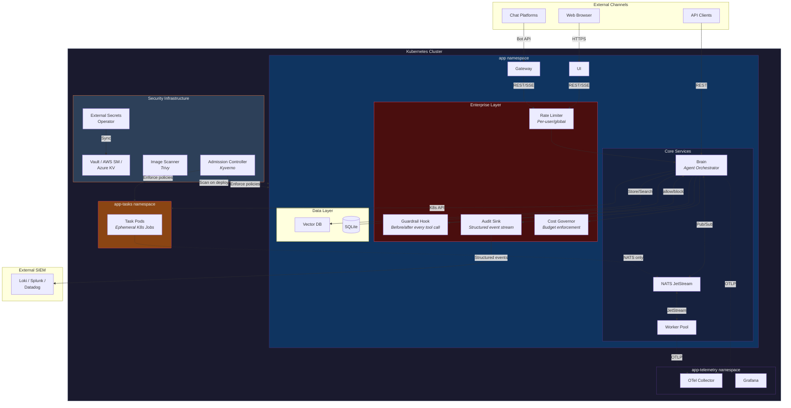
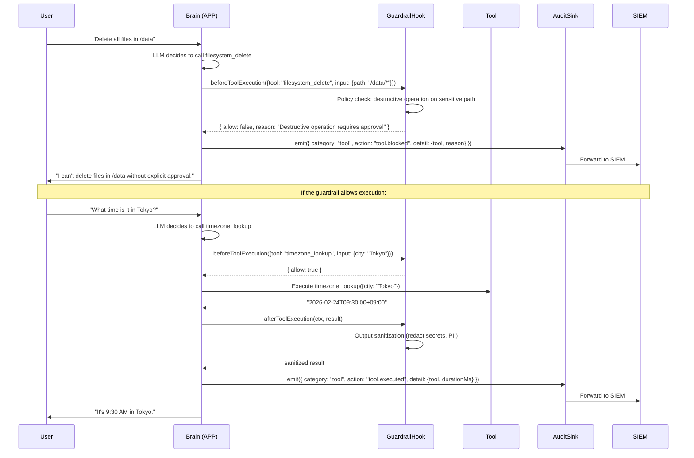
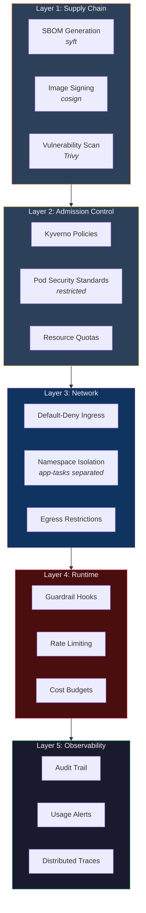
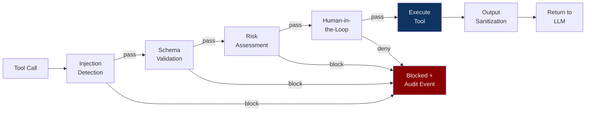
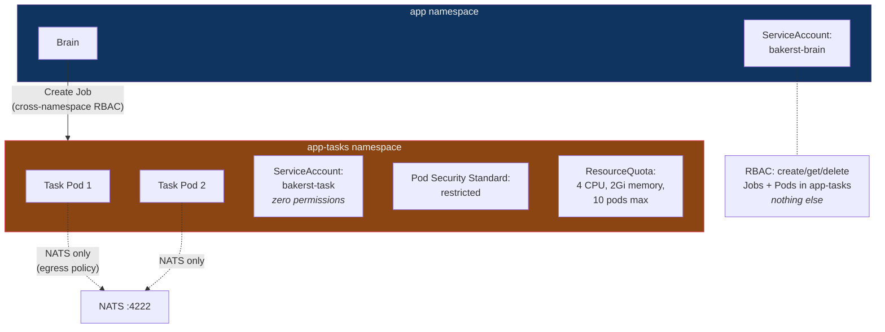
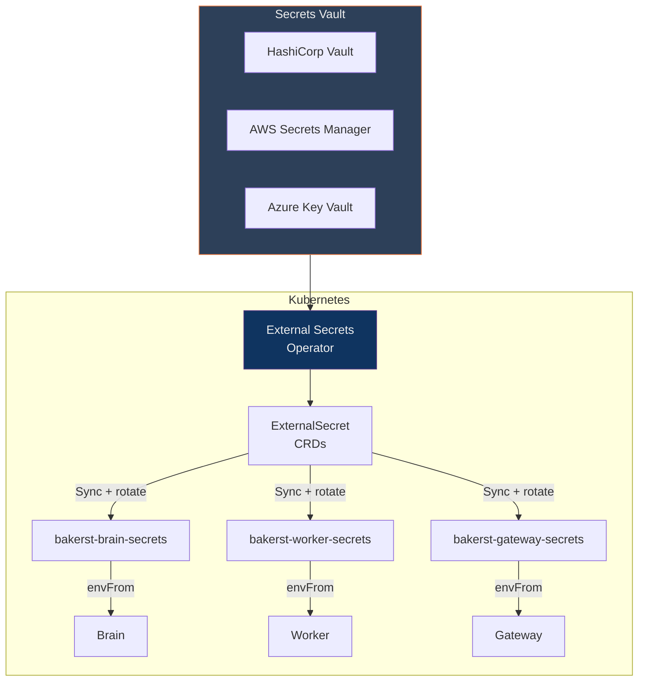
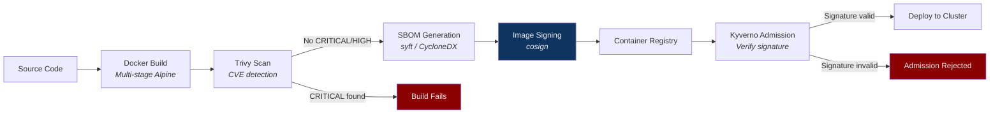
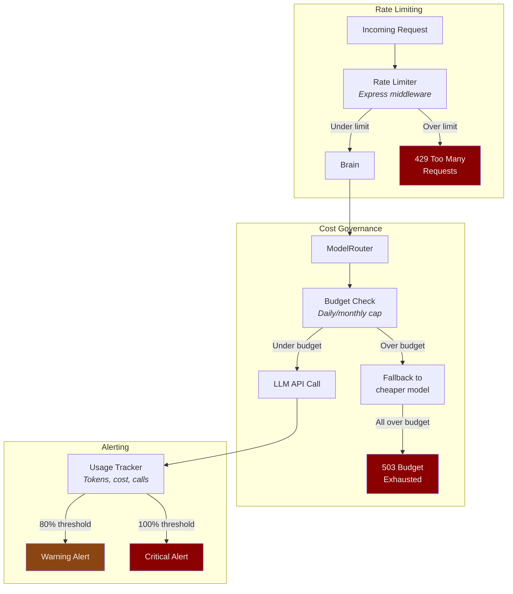
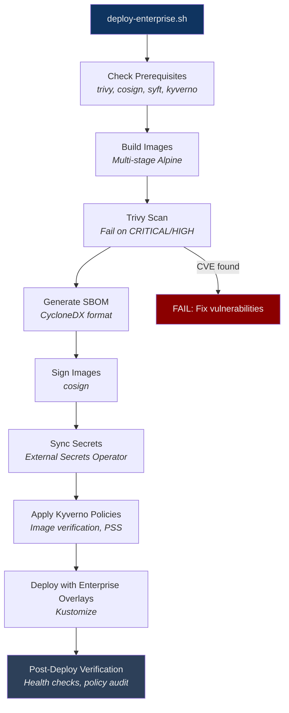

# Baker Street Enterprise: Hardened Distribution for Production AI Agents

Baker Street Enterprise is a security-hardened distribution layer that wraps any application built on the Baker Street framework. It adds defense-in-depth security controls — guardrail middleware, tamper-evident audit logging, supply chain verification, namespace isolation, and cost governance — without modifying the application itself. The consumer app runs identically; the enterprise layer injects security at the framework's hook points.

This document uses "APP" to refer to any application built on the Baker Street framework. Baker Street (the assistant) is one such application, but the enterprise layer is application-agnostic.

---

## Architecture



The enterprise layer (red) wraps the existing application without modifying it. Every security control is injected through `@bakerst/core` interfaces — the same application binary runs in both consumer and enterprise configurations.

---

## How Enterprise Hooks Work

The Baker Street framework defines two hook interfaces in `@bakerst/core` that enterprise deployments implement:



**Key design principle:** The consumer (open-source) deployment uses no-op implementations that return `{ allow: true }` and discard audit events. There is zero overhead — no async calls, no policy checks, no network I/O. The enterprise layer activates only when injected at startup.

### Hook Interfaces

```typescript
// Called on every tool execution — the primary security gate
interface GuardrailHook {
  beforeToolExecution(ctx: GuardrailContext): Promise<GuardrailResult>;
  afterToolExecution(ctx: GuardrailContext, result: unknown): Promise<unknown>;
}

// Structured event emission — ships to external SIEM
interface AuditSink {
  emit(event: AuditEvent): void;
}

// Context provided to every guardrail decision
interface GuardrailContext {
  conversationId: string;
  userId?: string;
  toolName: string;
  toolInput: unknown;
}
```

These hooks are called in the agent's tool execution loop — every tool call in both the synchronous `chat()` and streaming `chatStream()` paths passes through the guardrail before execution and the audit sink after.

---

## Security Architecture

### Defense-in-Depth Layers

The enterprise distribution adds security at every layer of the stack. Each layer operates independently — a failure in any single control is contained by all the others.



### 1. Guardrail Middleware

The guardrail implementation provides multiple defense capabilities, composed as a chain:

| Capability | What It Does | Example |
|-----------|--------------|---------|
| **Prompt injection detection** | Scans tool inputs for injection patterns | Blocks `ignore previous instructions` in tool arguments |
| **Destructive operation gate** | Requires approval for high-risk tools | `filesystem_delete`, `secret_update`, `restart_deployment` |
| **Output sanitization** | Strips secrets and PII from tool results before they reach the LLM | API keys, tokens, email addresses, SSNs |
| **Schema enforcement** | Validates tool arguments against strict schemas | Prevents type confusion or unexpected fields |
| **Human-in-the-loop** | Pauses execution for manual approval on configurable tools | Any tool marked `requiresApproval: true` |

Guardrails are **composable** — each capability is a function that takes a `GuardrailContext` and returns a `GuardrailResult`. The enterprise layer chains them in priority order, short-circuiting on the first `{ allow: false }`.



### 2. Audit Logging

The audit system produces a structured, append-only event stream that ships to an external SIEM. Events are write-only — the application cannot read, modify, or delete its own audit trail.

**Event taxonomy:**

| Category | Events | What's Captured |
|----------|--------|----------------|
| `auth` | `auth.success`, `auth.rejected`, `auth.token_rotated` | Actor, IP, method, rejection reason |
| `tool` | `tool.executed`, `tool.blocked`, `tool.error` | Tool name, input (sanitized), duration, guardrail decision |
| `secret` | `secret.read`, `secret.updated`, `secret.rotated` | Which keys, who requested, deployment restart triggered |
| `admin` | `admin.config_changed`, `admin.model_switched` | Setting name, old/new values, actor |
| `llm` | `llm.request`, `llm.response`, `llm.fallback` | Model, provider, tokens, cost, cache stats, errors |

```mermaid
graph LR
    BRAIN["Brain"] -->|AuditSink.emit()| BUF["Buffer<br/><i>In-memory batch</i>"]
    BUF -->|"Flush every 5s<br/>or 100 events"| SHIP["Shipper"]
    SHIP -->|HTTP POST| LOKI["Loki"]
    SHIP -->|Syslog| SPLUNK["Splunk"]
    SHIP -->|API| DD["Datadog"]

    SHIP -.->|"On failure"| DLQ["Dead Letter<br/>Queue (disk)"]
    DLQ -.->|"Retry"| SHIP

    style BUF fill:#2d4059,color:#eee
    style SHIP fill:#0f3460,color:#eee
    style DLQ fill:#8B0000,color:#eee
```

**Tamper evidence:** Events are signed with an HMAC chain — each event's hash includes the previous event's hash, creating a verifiable sequence. Any deletion or modification breaks the chain.

### 3. Namespace Isolation for Task Pods

The consumer deployment runs task pods in the same namespace as the brain. The enterprise distribution isolates them into a dedicated `app-tasks` namespace with stricter controls:



| Control | Consumer | Enterprise |
|---------|----------|------------|
| **Namespace** | Same as brain (`app`) | Dedicated (`app-tasks`) |
| **Pod Security Standard** | Not enforced | `restricted` (enforced by admission controller) |
| **Resource Quota** | None | 4 CPU, 2Gi memory, 10 concurrent pods |
| **Network Policy** | Default-deny ingress, NATS egress | Same + explicit cross-namespace deny |
| **RBAC** | Brain SA can manage tasks | Brain SA scoped to Jobs/Pods in `app-tasks` only |
| **Image Policy** | Any image | Signed images only (cosign verification via Kyverno) |

### 4. Secret Management

The consumer deployment stores secrets in Kubernetes Secrets created by `secrets.sh`. The enterprise distribution replaces this with External Secrets Operator, syncing from a real secrets vault:



Benefits over static K8s secrets:

- **Automatic rotation** — secrets refresh on a configurable interval without pod restarts
- **Audit trail** — every secret access is logged in the vault's audit log
- **Centralized policy** — access control, rotation schedules, and expiry managed in the vault
- **No plaintext in manifests** — `ExternalSecret` CRDs reference paths, not values

### 5. Supply Chain Security

Every image deployed in the enterprise distribution passes through a verification pipeline before admission:



| Step | Tool | What It Does |
|------|------|-------------|
| **Vulnerability scan** | Trivy | Scans for CVEs in OS packages and language dependencies; fails on CRITICAL or HIGH severity |
| **SBOM generation** | syft | Produces CycloneDX software bill of materials for every image |
| **Image signing** | cosign | Signs the image digest with a keyless (OIDC) or key-based signature |
| **Admission control** | Kyverno | Verifies cosign signature on every pod admission; unsigned images are rejected |
| **Frozen lockfiles** | pnpm | `--frozen-lockfile` prevents dependency tampering during builds |

### 6. Rate Limiting & Cost Governance



| Control | Configuration | Default |
|---------|--------------|---------|
| **Requests per minute** (per user) | `RATE_LIMIT_PER_USER` | 30 |
| **Requests per minute** (global) | `RATE_LIMIT_GLOBAL` | 200 |
| **Daily cost cap** (USD) | `COST_LIMIT_DAILY` | $50 |
| **Monthly cost cap** (USD) | `COST_LIMIT_MONTHLY` | $1,000 |
| **Warning threshold** | `COST_ALERT_THRESHOLD` | 80% |
| **Fallback behavior** | `COST_FALLBACK_STRATEGY` | `downgrade` (use cheaper model) |

The ModelRouter already tracks token usage and cost per request via its `onApiCall` hook. The enterprise layer wraps this with budget enforcement — if the daily cap is hit, requests automatically downgrade to a cheaper model before refusing entirely.

---

## Security Posture Comparison

| Control | Consumer (Open Source) | Enterprise (Hardened) |
|---------|----------------------|----------------------|
| **Network isolation** | Default-deny ingress, per-service allow | + Cross-namespace deny, task namespace isolation |
| **Pod security** | Non-root, read-only FS, drop caps, seccomp | + Pod Security Standards enforced cluster-wide |
| **Secret management** | K8s Secrets via `secrets.sh` | External Secrets Operator (Vault/AWS/Azure) |
| **Tool execution** | Direct execution | Guardrail middleware (injection detection, HITL) |
| **Audit logging** | SQLite API audit table | Tamper-evident SIEM integration (Loki/Splunk) |
| **Output sanitization** | Regex-based token redaction | Guardrail post-processing (PII, secrets, sensitive data) |
| **Supply chain** | Frozen lockfiles, multi-stage builds | + Trivy scan, SBOM, cosign signing, Kyverno admission |
| **Rate limiting** | None | Per-user and global request limits |
| **Cost governance** | None | Daily/monthly budgets with model fallback |
| **Image admission** | Any image | Signed images only (Kyverno policy) |
| **Resource quotas** | Per-pod limits | + Namespace-level quotas on task pods |
| **Auth** | Bearer token | Bearer token + audit events on failure |

---

## Deployment

### Enterprise Deploy Script

The enterprise deployment wraps the standard deploy with security verification:

```bash
# Full enterprise deploy — runs all checks, then deploys with hardened overlays
./deploy-enterprise.sh

# With options:
./deploy-enterprise.sh --skip-scan        # skip Trivy vulnerability scan
./deploy-enterprise.sh --skip-sign        # skip cosign image signing
./deploy-enterprise.sh --skip-sbom        # skip SBOM generation
./deploy-enterprise.sh --dry-run          # validate everything without applying
```



### Enterprise Kustomize Overlays

The enterprise distribution uses Kustomize overlays that patch the base manifests without modifying them:

```
baker-street-hardened/
├── k8s/
│   ├── overlays/enterprise/
│   │   ├── kustomization.yaml          # References base from baker-street repo
│   │   ├── namespace-tasks.yaml        # Dedicated task namespace
│   │   ├── resource-quotas.yaml        # Namespace-level resource limits
│   │   ├── pod-security.yaml           # PSS restricted enforcement
│   │   ├── network-policies-enterprise.yaml  # Cross-namespace restrictions
│   │   └── rbac-narrowed.yaml          # Scoped-down brain RBAC
│   ├── external-secrets/
│   │   ├── cluster-secret-store.yaml   # Vault/AWS/Azure connection
│   │   └── external-secrets.yaml       # Secret sync CRDs
│   └── kyverno/
│       ├── require-image-signature.yaml
│       ├── restrict-registries.yaml
│       └── enforce-labels.yaml
├── packages/
│   ├── guardrails/                     # GuardrailHook implementation
│   └── audit/                          # AuditSink implementation
├── scripts/
│   └── deploy-enterprise.sh
└── docs/
    └── compliance/
```

---

## Compliance

### Control Mapping

The enterprise distribution maps security controls to common compliance frameworks:

| Control | SOC2 (TSC) | ISO 27001 | CIS K8s Benchmark |
|---------|-----------|-----------|-------------------|
| Network isolation | CC6.1 (Logical access) | A.13.1.1 (Network controls) | 5.3.2 (NetworkPolicy) |
| Pod security | CC6.1 | A.12.6.1 (Technical vuln mgmt) | 5.2.* (Pod Security Standards) |
| Audit logging | CC7.2 (Monitoring) | A.12.4.1 (Event logging) | — |
| Secret management | CC6.1 | A.10.1.2 (Key management) | 5.4.1 (Secrets as files) |
| Image signing | CC8.1 (Change mgmt) | A.14.2.4 (Secure dev) | 5.5.1 (Image provenance) |
| RBAC least privilege | CC6.3 (Role-based access) | A.9.4.1 (Access restriction) | 5.1.* (RBAC) |
| Rate limiting | CC6.1 | A.13.1.3 (Network segregation) | — |
| Cost governance | CC3.4 (Risk assessment) | A.12.1.3 (Capacity mgmt) | — |
| SBOM | CC8.1 | A.14.2.5 (Secure dev principles) | — |

### Threat Model Summary

| Threat | Mitigation | Layer |
|--------|-----------|-------|
| **Prompt injection via tool args** | Guardrail injection detection + schema validation | Runtime |
| **Data exfiltration via tool results** | Output sanitization in afterToolExecution | Runtime |
| **Compromised task pod** | Namespace isolation, zero RBAC, NATS-only egress, 30min timeout | Network + K8s |
| **Supply chain attack** | Trivy scan, cosign verification, Kyverno admission, frozen lockfiles | Supply Chain |
| **Secret leakage** | External Secrets Operator, scoped K8s secrets, token redaction | Secret Mgmt |
| **Cost runaway** | Daily/monthly budgets, model downgrade fallback, usage alerts | Cost Governance |
| **Unauthorized access** | Bearer token auth, audit events on failure, rate limiting | Application |
| **Insider threat** | Tamper-evident audit trail, HMAC event chain, write-only SIEM | Observability |
| **Denial of service** | Per-user + global rate limits, resource quotas on task namespace | Rate Limiting |
| **Stale dependencies** | SBOM tracking, automated Trivy scans in CI | Supply Chain |

---

## Quick Start

```bash
# Clone both repos
git clone https://github.com/The-Baker-Street-Project/baker-street.git
git clone https://github.com/The-Baker-Street-Project/baker-street-hardened.git

# Install the enterprise guardrails and audit packages
cd baker-street-hardened
pnpm install

# Deploy with enterprise hardening
./scripts/deploy-enterprise.sh
```

The enterprise deploy script detects the base Baker Street repo, runs security checks, applies hardened overlays, and deploys everything. The APP runs identically — the only difference is the security layer injected at startup.

---

## Project Structure

```
baker-street-hardened/
├── packages/
│   ├── guardrails/               # Implements GuardrailHook from @bakerst/core
│   │   ├── src/
│   │   │   ├── index.ts          # Composable guardrail chain
│   │   │   ├── injection.ts      # Prompt injection detection
│   │   │   ├── schema.ts         # Tool argument validation
│   │   │   ├── risk.ts           # Destructive operation gate
│   │   │   ├── hitl.ts           # Human-in-the-loop approval
│   │   │   └── sanitize.ts       # Output sanitization (PII, secrets)
│   │   └── package.json
│   └── audit/                    # Implements AuditSink from @bakerst/core
│       ├── src/
│       │   ├── index.ts          # Buffered event shipper
│       │   ├── sinks/
│       │   │   ├── loki.ts       # Grafana Loki integration
│       │   │   ├── splunk.ts     # Splunk HEC integration
│       │   │   └── file.ts       # Local file fallback
│       │   └── hmac-chain.ts     # Tamper-evident event signing
│       └── package.json
├── k8s/
│   ├── overlays/enterprise/      # Kustomize patches for hardened deploy
│   ├── external-secrets/         # Vault/AWS/Azure secret sync
│   └── kyverno/                  # Admission control policies
├── scripts/
│   ├── deploy-enterprise.sh      # Full enterprise deploy pipeline
│   └── scan.sh                   # Standalone image scanning
├── docs/
│   └── compliance/
│       ├── controls-inventory.md # Full security controls list
│       ├── threat-model.md       # STRIDE threat model
│       └── soc2-mapping.md       # SOC2 TSC control mapping
└── tests/
    ├── guardrails.test.ts        # Guardrail unit tests
    ├── audit.test.ts             # Audit sink tests
    └── e2e/
        └── injection.test.ts     # Prompt injection detection e2e
```
