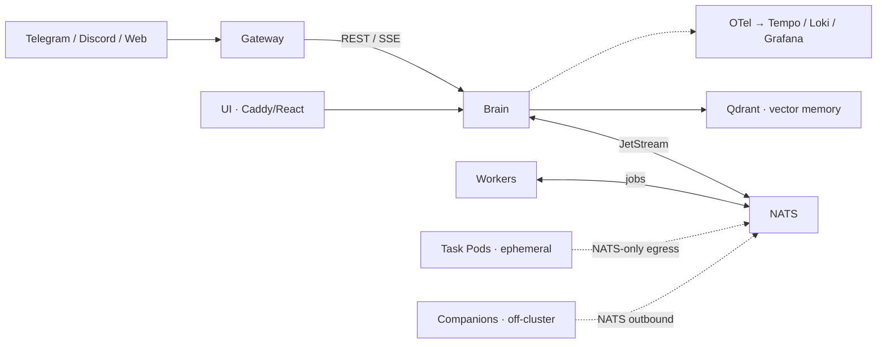
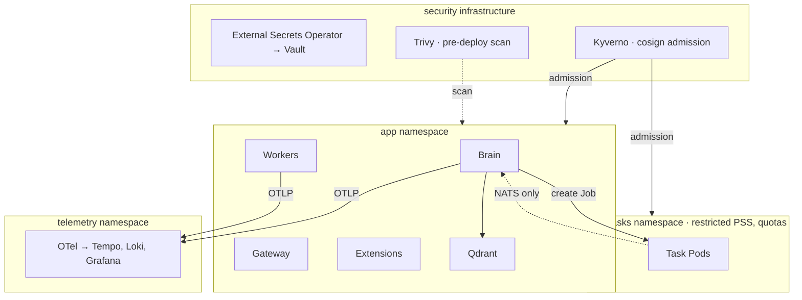

# The Baker Street Project by Savviety — Executive Summary (Architects & Engineers)

> **"What if your app was a prompt?"**
>
> Baker Street is a Kubernetes-native, isolation-first framework for building and running LLM-powered applications. The prompt defines your agent's behavior; the framework supplies orchestration, memory, execution isolation, and defense-in-depth security.

---

## System Architecture

Baker Street deploys as standard Kubernetes workloads with four core services, a messaging backbone, and pluggable extensions:

- **Brain** — LLM orchestrator and tool loop. Manages conversations, dispatches jobs, and is the sole service with access to vector memory.
- **Workers** — NATS JetStream consumers that execute background jobs. Zero ingress; NATS-only egress.
- **Gateway** — Multi-channel bridge (Telegram, Discord, web) that normalizes inbound messages to Brain's REST/SSE API.
- **UI** — React frontend served via Caddy with automatic TLS.

**Data layer**: Qdrant with Voyage embeddings for long-term vector memory; SQLite for conversations, jobs, schedules, and skill metadata.

**Event backbone**: NATS JetStream with durable subjects for chat, job dispatch, task progress, and extension auto-discovery. All inter-service communication flows through NATS — there are no direct pod-to-pod calls outside of Brain → Qdrant.

**Execution isolation**: Two mechanisms extend the agent's reach without broadening its access:
- **Task Pods** — Ephemeral Kubernetes Jobs for goal-based work. NATS-only egress, dedicated namespace, tight quotas. Torn down on completion.
- **Companions** — Lightweight agents on bare metal or VMs outside the cluster. Outbound NATS connection only; no inbound ports. Useful for on-prem hardware, edge devices, or environments that can't run Kubernetes.

---

## Security Model

Baker Street implements defense-in-depth across four layers. The consumer deployment ships secure by default; the enterprise layer adds governance, audit, and supply chain controls without forking the codebase.

### Layer 1 — Network Isolation

Default-deny NetworkPolicies on all namespaces. Qdrant is accessible only from Brain. Workers and Task Pods have zero ingress and NATS-only egress. In the enterprise configuration, Task Pods run in a dedicated namespace (`app-tasks`) with cross-namespace NetworkPolicies preventing lateral movement.

### Layer 2 — Pod Hardening

All pods run non-root with read-only root filesystems, all capabilities dropped, seccomp set to RuntimeDefault. The only writable path is `/tmp` (allowlisted and ephemeral). Multi-stage minimal container builds keep the attack surface small.

### Layer 3 — Tool & API Safety

Brain's API requires bearer-token authentication. Tool execution is constrained by command allowlists with environment variable redaction, a 30-second timeout, and filesystem path allowlists. All tool output passes through secret scrubbing before it reaches the LLM or the user. CORS is locked to a whitelist in production.

### Layer 4 — Enterprise Governance (Hardened Layer)

This layer wraps the same application with additional controls:

- **Guardrail middleware** on every tool call — schema enforcement, injection detection, destructive-action gates, optional human-in-the-loop approval, and output sanitization.
- **Tamper-evident audit stream** — HMAC-chained events streamed to your SIEM, with structured categories (auth, tool, secret, admin, LLM).
- **Vault-backed secrets** — External Secrets Operator with rotation support for HashiCorp Vault, AWS Secrets Manager, and Azure Key Vault.
- **Supply chain verification** — Trivy scanning, SBOM generation, cosign image signing, Kyverno admission policies for signature verification, and frozen lockfiles.
- **Rate and cost governance** — Budget and rate-limit hooks at framework integration points, applied before tool execution.
- **Task Pod isolation** — Pod Security Standards (restricted profile), resource quotas, and Brain RBAC scoped exclusively to Job and Pod resources in the tasks namespace.

---

## Extension Model

Baker Street is designed so that new capabilities ship without redeploying the core platform.

**MCP Skills** — Prompt-driven tools that execute via stdio, sidecar, or service. A skill is a prompt plus a runtime binding; the framework handles discovery, invocation, and sandboxing.

**Pod Extensions** — Deploy a pod with the right NATS subject annotations and it auto-registers as a tool. The framework discovers it, exposes it to Brain, and removes it when the pod terminates. "Deploy a pod, gain a tool."

**Companions** — Off-cluster agents that connect back via NATS. Same extension interface, different deployment target. Useful for accessing on-prem resources, GPU nodes, or air-gapped environments.

---

## Developer Experience

**Local development**: The full stack runs locally via Docker Compose for development and testing. The same configuration files target both Compose and Kubernetes with minimal changes.

**Deployment**: A single deploy script provisions the full stack including optional telemetry. Blue/green upgrades with continuity handoff ensure zero-downtime transitions. The telemetry stack (OpenTelemetry, Tempo, Loki, Grafana, Prometheus) deploys to an isolated namespace and is opt-in.

**Building extensions**: Create a container, subscribe to a NATS subject, and deploy. The framework handles the rest. MCP skills require only a prompt file and a runtime target.

---

## Use Cases

**DevOps/SRE Copilot** — An on-call engineer asks Baker Street to diagnose a failing deployment. Brain dispatches an ephemeral Task Pod that executes allowlisted kubectl commands, surfaces the root cause, and logs every action to the SIEM. The pod tears down when the investigation completes. No broad cluster access was granted.

**Compliance & IT Automation** — A compliance analyst triggers a policy audit across namespaces. Guardrail middleware validates each tool call against schema and destructive-action gates. The audit stream captures every action with HMAC-chained integrity. Rate and cost controls prevent runaway execution.

**Research & Analyst Workbench** — A data team kicks off a multi-hour analysis touching sensitive data. Baker Street runs it in an isolated Task Pod with restricted PSS and resource quotas, persists findings to Qdrant for future recall, and tears down the environment on completion.

---

## Key Decisions & Trade-offs

| Decision | Rationale | Trade-off |
|---|---|---|
| NATS JetStream over Kafka/RabbitMQ | Lightweight, embeddable, native K8s fit, built-in persistence | Smaller ecosystem; less enterprise tooling around it |
| Qdrant over Pinecone/Weaviate | Self-hosted, no external dependency, strong filtering | Operational burden vs. managed services |
| SQLite for metadata | Zero-dependency, embedded, fast for single-writer workloads | Not HA out of the box; Postgres path available for scale |
| Ephemeral Task Pods over long-lived workers | Blast radius containment; clean-slate execution | Higher pod churn; scheduling latency on cold starts |
| Enterprise layer as middleware, not fork | Same codebase, same tests, governance is additive | Complexity in hook-point design; must avoid performance regression |

---

*The Baker Street Project by Savviety — Kubernetes-native AI agents with defense-in-depth by default.*
