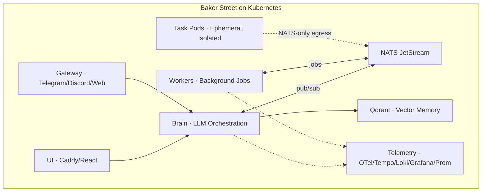

# The Baker Street Project by Savviety — Executive Summary

> **"What if your app was a prompt?"**
>
> Baker Street is a Kubernetes-native platform that lets you build, deploy, and govern LLM-powered agents with the same security posture you expect from production infrastructure.

---

## The Problem

AI agent frameworks are proliferating — but almost none of them ship with the security, isolation, and auditability that enterprise ops and security teams require. Teams are left bolting on governance after the fact, slowing adoption and increasing risk.

## What Baker Street Does

Baker Street is a multi-service AI agent platform that runs as standard Kubernetes workloads. It combines an LLM orchestration layer ("Brain"), a background job system ("Workers"), ephemeral isolated execution ("Task Pods"), vector memory (Qdrant/Voyage), and a NATS JetStream messaging backbone — all behind a React/Caddy UI with gateway support for Telegram, Discord, and web.

It deploys with a single script, upgrades via blue/green with continuity handoff, and optionally includes a full telemetry stack (OpenTelemetry, Tempo, Loki, Grafana, Prometheus) in an isolated namespace.

## Why Baker Street Is Different

### Security by Default, Not by Afterthought

Default-deny NetworkPolicies, non-root read-only pods, NATS-only egress for workers and tasks, Qdrant reachable only from Brain, bearer-token APIs, allowlisted commands, and output sanitization — all out of the box.

### Enterprise Hardening as a Layer, Not a Fork

The same application runs with or without the enterprise governance layer. When activated, it adds guardrail middleware on every tool call, a tamper-evident audit stream to your SIEM, vault-backed secrets via External Secrets Operator, signed images with admission checks (cosign/Kyverno/Trivy), namespace isolation with quotas for Task Pods, and rate/cost governance.

### Isolation-First Execution

Ephemeral Task Pods handle goal-based work in tightly contained blast radii. Agents act with power but without broad access.

### "Deploy a Pod, Gain a Tool"

Capabilities are composable. MCP skills map prompts through stdio, sidecars, or services. Pod-based extensions auto-discover via NATS. Companions extend the agent onto non-Kubernetes machines. New capabilities ship without redeploying the core.

## Use Cases

**DevOps/SRE Copilot** — Your on-call engineer asks Baker Street to diagnose a failing deployment. It executes allowlisted kubectl commands in an ephemeral pod, surfaces the root cause, and logs every action to your SIEM — no broad cluster access required.

**Compliance & IT Automation** — A compliance analyst triggers a policy audit across namespaces. Baker Street runs the checks with guardrails, enforces cost/rate controls, and produces an audit trail that satisfies your security team without custom tooling.

**Analyst & Research Workbench** — A data team member kicks off a long-running analysis that touches sensitive data. Baker Street runs it in an isolated Task Pod, persists findings to vector memory for future recall, and tears down the environment when the job completes.

## What to Expect

**Time-to-value**: Single deploy script for the full stack. Blue/green upgrades with continuity handoff. No multi-day integration projects.

**Governance clarity**: Consumer deployment and enterprise hardening are cleanly separated. Evaluate the platform first; layer on governance when ready.

**Extensibility at speed**: Add capabilities through MCP skills, pod extensions, or Companions — without touching the core platform.

---

*The Baker Street Project by Savviety — Kubernetes-native AI agents with defense-in-depth by default.*
