# Baker Street: Kubernetes-Native Personal AI Agent

Baker Street is a self-hosted, security-first AI agent system built on Kubernetes. It orchestrates conversations with Claude, dispatches background tasks to a worker pool, launches isolated task pods for goal-oriented work, manages long-term memory through vector embeddings, and connects to your world through extensible plugins and multi-channel gateways — all running inside your own cluster with defense-in-depth security that no single-process deployment can match.

---

## Architecture

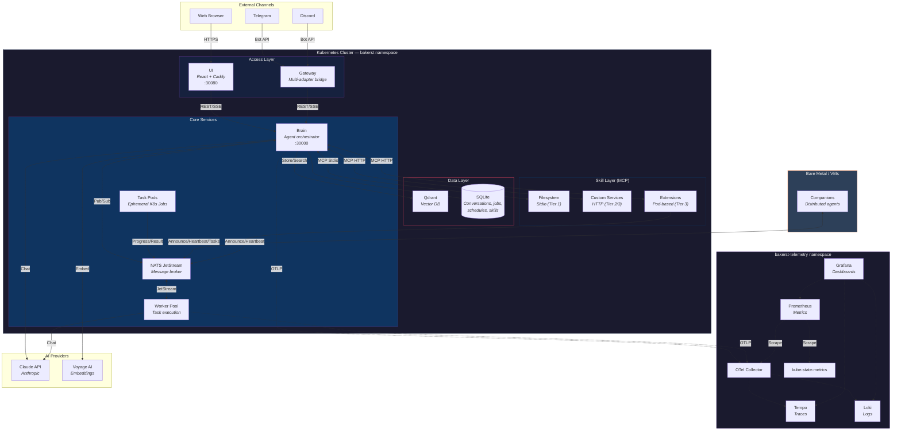

---

## Security Architecture

Running Baker Street on Kubernetes provides defense-in-depth that no single-process AI agent can match. Every layer — network, pod, container, application — enforces least privilege independently. A compromise of any single component is contained by all the others.

### Network Isolation

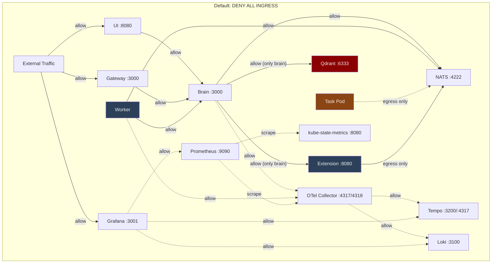

The cluster enforces **default-deny ingress** on every pod, with explicit NetworkPolicy rules whitelisting only the connections that are actually needed:

- **Qdrant** (the vector database holding your memories) is accessible **only from the brain** — no other pod can reach it
- **Workers have zero inbound access** — they pull work exclusively from the NATS message queue
- **Task pods are fully locked down** — zero ingress, egress limited to NATS port 4222 only (see [Task Pod Isolation](#task-pod-isolation))
- **Extensions are network-isolated** — only brain can reach them (port 8080); extensions can only reach NATS (port 4222). They cannot reach each other, Qdrant, the internet, or any other service
- **NATS is sealed** to brain, worker, and extension pods only (plus task pod egress)
- **Observability traffic** is isolated in a separate namespace (`bakerst-telemetry`) with cross-namespace policies restricting access to only the brain and worker
- **Prometheus** is accessible only from Grafana; **kube-state-metrics** is accessible only from Prometheus

### Pod Security

Every deployment enforces a strict security posture at the Kubernetes level:

| Control | Setting | Benefit |
|---------|---------|---------|
| **Non-root execution** | `runAsNonRoot: true`, UID 1000 | Prevents root-level container exploits |
| **Read-only filesystem** | `readOnlyRootFilesystem: true` | Blocks filesystem-based persistence of malware |
| **No privilege escalation** | `allowPrivilegeEscalation: false` | Prevents setuid/setgid exploits |
| **All capabilities dropped** | `capabilities: drop: [ALL]` | Removes all Linux kernel capabilities |
| **Seccomp profile** | `seccompProfile: RuntimeDefault` | Filters dangerous system calls |

Writable mounts are limited to `/tmp` (emptyDir) and explicit data volumes — nothing else can be written.

### Secret Scoping & Least Privilege

Secrets are segmented into three scoped Kubernetes secrets, each containing only what that service needs:

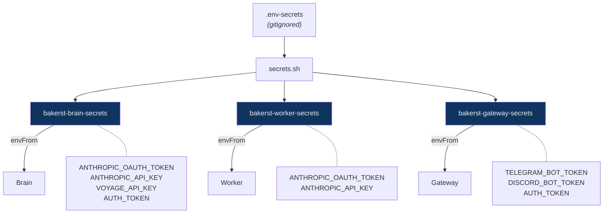

- The **gateway never sees** Anthropic API keys or Voyage keys
- **Workers never see** Telegram/Discord tokens or the auth token
- The brain's RBAC role is scoped to a **single named secret** — it cannot read any other secret in the namespace
- `AUTH_TOKEN` is auto-generated (32-byte hex) and validated with **timing-safe comparison** to prevent side-channel attacks

### Container Hardening

All images use **multi-stage Docker builds** on Alpine Linux:

- Build tools (compilers, Python, make) exist only in the builder stage — they never reach the production image
- Production images contain only the compiled application and runtime dependencies
- The UI image doesn't even include Node.js — it runs on **Caddy** with static assets, and strips file capabilities from the binary (`setcap -r`)
- Lockfiles are frozen (`--frozen-lockfile`) to prevent supply-chain tampering during builds

### Application-Level Security

- **Bearer token authentication** on all Brain API routes (except `/ping` health check)
- **Command allowlisting** in workers — only pre-approved binaries can execute, with blocked environment variables (PATH, LD_PRELOAD, API keys) and a 30-second timeout
- **Path traversal protection** in the filesystem plugin — all paths resolved and validated against an allowlist
- **Output sanitization** — API keys and tokens matching known patterns are redacted from tool outputs before they reach the model
- **CORS whitelist** in production (permissive only in dev mode)

### Task Pod Isolation

Task pods — ephemeral Kubernetes Jobs launched by the brain — receive the strictest security posture in the system:

| Control | Setting |
|---------|---------|
| **ServiceAccount** | `bakerst-task` — zero RBAC permissions, no K8s API access |
| **Ingress** | Default-deny (zero inbound traffic) |
| **Egress** | `allow-task-to-nats` — only NATS port 4222 |
| **Filesystem** | Read-only root, writable `/tmp` only |
| **Host mounts** | Allowlisted via `TASK_ALLOWED_PATHS`; rejected if not configured; read-only unless explicitly granted |
| **Resource limits** | 512Mi memory, 500m CPU |
| **Timeout** | 30-minute `activeDeadlineSeconds` (configurable per-task) |
| **Cleanup** | `ttlSecondsAfterFinished: 300` — auto-removed 5 minutes after completion |
| **Retries** | `backoffLimit: 0` — no automatic retries |
| **Pod security** | `runAsNonRoot`, UID 1000, drop all capabilities, seccomp RuntimeDefault |

A task pod cannot reach the Kubernetes API, cannot receive incoming connections, cannot write to its own filesystem (except `/tmp`), and is automatically garbage-collected. Even if the code running inside is compromised, the blast radius is limited to streaming messages over NATS for at most 30 minutes.

---

## Feature Highlights

### Conversational AI Agent

The Brain is the central orchestrator — a stateful agent that maintains multi-turn conversations, calls tools iteratively (up to 10 rounds per turn), and decides when to handle requests directly versus dispatching work to the worker pool.

- **Streaming responses** via Server-Sent Events for real-time feedback
- **Conversation persistence** in SQLite with full history
- **Multi-model routing** with role-based model selection (agent, observer, worker) and configurable fallback chains
- **Channel-aware formatting** — adapts responses for web, Telegram, or Discord

### Background Job System

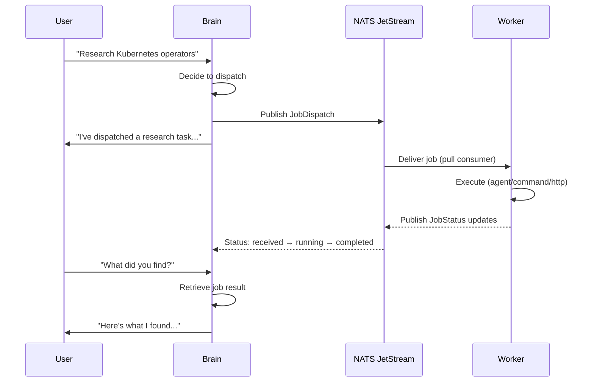

Three job types flow through NATS JetStream with durable delivery guarantees:

| Type | Description | Example |
|------|-------------|---------|
| **Agent** | Claude-powered task on a worker | "Summarize this document" |
| **Command** | Shell command with strict allowlisting | `kubectl get pods -n production` |
| **HTTP** | REST API call to external services | `GET https://api.example.com/status` |

Workers report status updates in real time (received, running, completed, failed), and a zombie reaper automatically cleans up jobs stuck for more than two minutes.

### Task Pods

Task pods are ephemeral Kubernetes Jobs launched on demand for isolated, goal-oriented work. The brain creates each pod via the K8s API, tracks state in SQLite, and communicates over NATS.

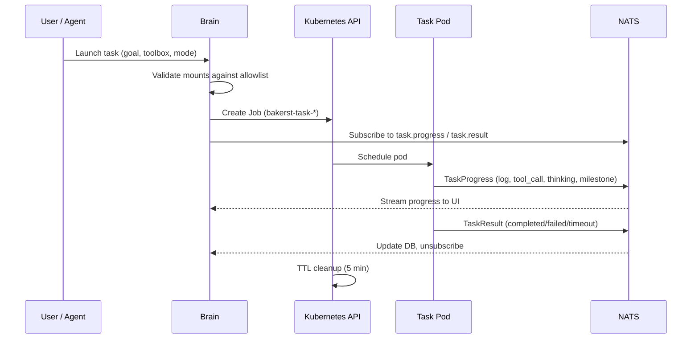

Two execution modes:

| Mode | Description |
|------|-------------|
| **Agent** | Full reasoning loop with tools — the toolbox image runs an autonomous agent |
| **Script** | Runs a shell command or script inline, streaming stdout as progress events |

Key properties:

- **Host mount allowlisting** — every mount is checked against `TASK_ALLOWED_PATHS`; requests are rejected outright if the allowlist is unconfigured
- **Toolbox images** — container images from the external `bakerst-toolboxes` repo, each packaging a different set of tools
- **30-minute timeout** with configurable override per task
- **Auto-cleanup** after 5 minutes via Kubernetes TTL controller
- **Zero retries** — failures are reported, not repeated
- **Full security isolation** — see [Task Pod Isolation](#task-pod-isolation) above
- **Feature-flagged** — enable with `FEATURE_TASK_PODS=true`

### Long-Term Memory (RAG)

The memory system uses Qdrant vector search with Voyage AI embeddings to store and retrieve facts across conversations.

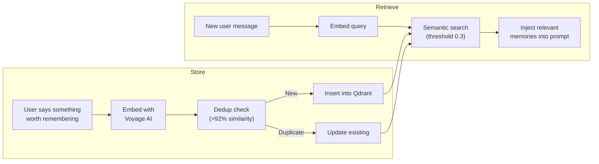

- **Six categories**: gear, preferences, homelab, personal, work, general
- **Automatic deduplication**: Updates existing memories when similarity exceeds 92%
- **Two-phase memory workers**:
  - **Observer** (Phase 1): Extracts structured observations from conversations using a cheaper model — decisions, preferences, facts, issues, action items
  - **Reflector** (Phase 2): Compresses observation logs into higher-level abstractions
- **Circuit breaker** on the embedding API prevents cascading failures

### Extensible Skill System (MCP)

Skills are added at runtime without redeployment — the agent can even install its own. Four tiers provide flexibility from simple prompt instructions to full Kubernetes services:

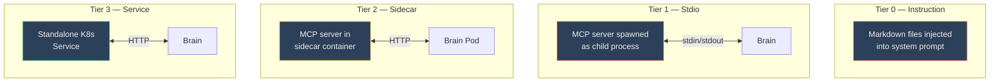

| Tier | Transport | Lifecycle | Use Case |
|------|-----------|-----------|----------|
| **0 — Instruction** | None (prompt injection) | Static | Domain knowledge, guidelines |
| **1 — Stdio** | Child process stdin/stdout | Brain-managed | Lightweight tools (filesystem) |
| **2 — Sidecar** | HTTP in same pod | Pod-scoped | Tightly coupled tools |
| **3 — Service** | HTTP to K8s Service | Independent | Shared/heavy tools |

**Built-in plugins**:
- **Filesystem** (Tier 1 stdio): Sandboxed file read/list/info with path traversal protection

**Self-management**: The agent can create, update, enable, disable, and delete its own Tier 0 and Tier 1 skills, and browse the public MCP registry to discover new ones.

### Extensions — Pod-Based Tool Plugins

Extensions let developers add tool capabilities by deploying a Kubernetes pod. No brain restarts, no config changes — deploy a pod and the agent gains new tools automatically.

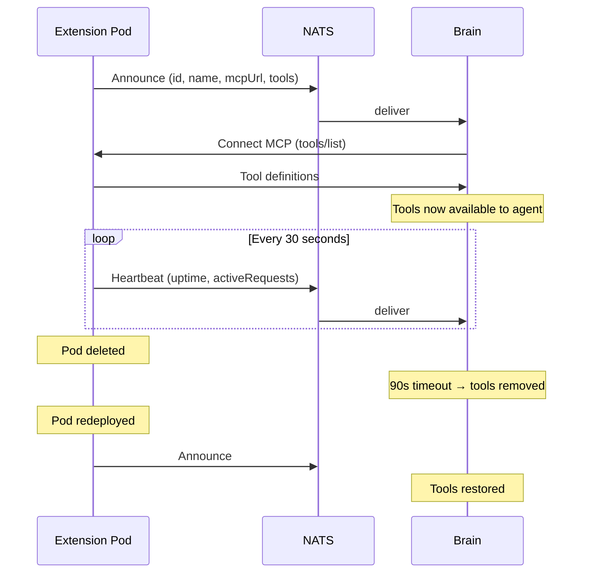

Each extension serves tools via an MCP HTTP endpoint and announces itself on NATS. The brain discovers tools via `tools/list`, makes them directly available to the agent's LLM, and monitors health via heartbeats. The `@bakerst/extension-sdk` package provides a one-liner setup; any language can implement the protocol directly.

**Security note:** The platform provides network isolation (only brain can reach extensions, extensions can only reach NATS) but each extension is responsible for its own input validation, authorization, rate limiting, and output sanitization. The brain trusts tool results — a poorly written extension can leak data or cause unintended side effects. See `docs/extensions.md` for the full security model.

- **Feature-flagged** — enable with `FEATURE_EXTENSIONS=true`

### Companions — Distributed Agent Network

Companions are lightweight autonomous agent daemons that run on bare metal, NAS boxes, or VMs outside the Kubernetes cluster. They extend the agent's reach to machines that don't run inside K8s.

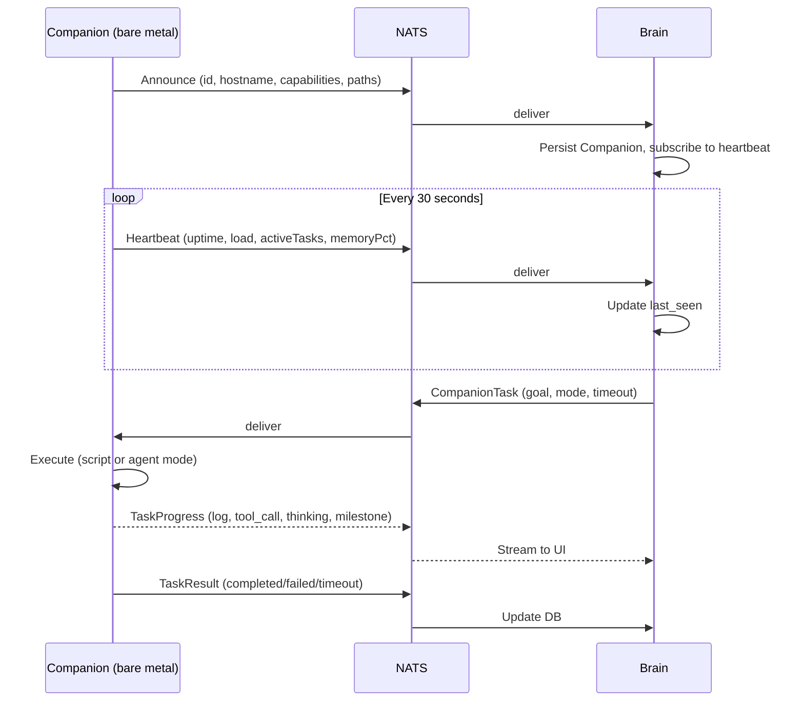

Each Companion connects outbound to the NATS server and:

- **Announces capabilities** (e.g., filesystem, docker, zfs, systemctl) and allowed paths on connect
- **Heartbeats every 30 seconds** — the brain marks an Companion offline after 3 missed heartbeats (90s)
- **Receives tasks** dispatched by the brain, executing them locally in script or agent mode
- **Streams progress** back over NATS in real time

Configuration is a JSON file specifying the Companion's ID, NATS URL, capabilities, allowed paths, max concurrency, and Anthropic API key.

- **Feature-flagged** — enable with `FEATURE_COMPANIONS=true`

### Scheduled Tasks

Cron-based scheduling dispatches jobs automatically on a recurring basis. Schedules support the same three job types (agent, command, http) and can be managed through the UI or by the agent itself.

### Multi-Channel Gateway

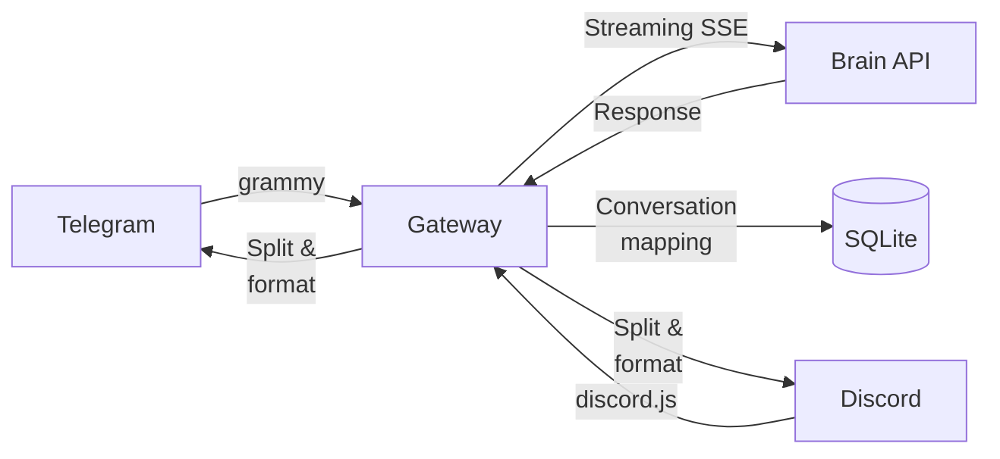

The gateway bridges external messaging platforms to the brain with:

- **Per-channel conversation persistence** — each Telegram chat or Discord channel maps to a unique conversation
- **Platform-aware message splitting** — respects Telegram's 4,096 and Discord's 2,000 character limits
- **Markdown formatting** with graceful plain-text fallback
- **Allowlist filtering** — restrict access to specific chat/channel IDs
- **Typing indicators** while the brain is processing

### Web UI

A React single-page application served by Caddy provides a full management interface:

- **Streaming chat** with real-time tool execution feedback
- **Conversation history** browser
- **Job monitoring** dashboard with live status polling
- **Task pod monitoring** with streaming progress and result display
- **Memory management** with semantic search and category browsing
- **Extensions page** with three tabs:
  - **Skills** — manage Tier 0 instruction skills, toggle enable/disable, upload zip archives
  - **MCP Servers** — manage Tier 1-3 MCP connections, browse the public registry, one-click install
  - **Toolboxes** — view and build task pod toolbox images, check build status
- **Model configuration** with role assignment and cost display
- **Schedule management** with cron expression builder
- **Secret management** with masked display and service restart
- **System health** dashboard showing component status

---

## Zero-Downtime Deployments

Baker Street uses a blue-green deployment strategy with a NATS-based transfer protocol for graceful handoff between brain versions:

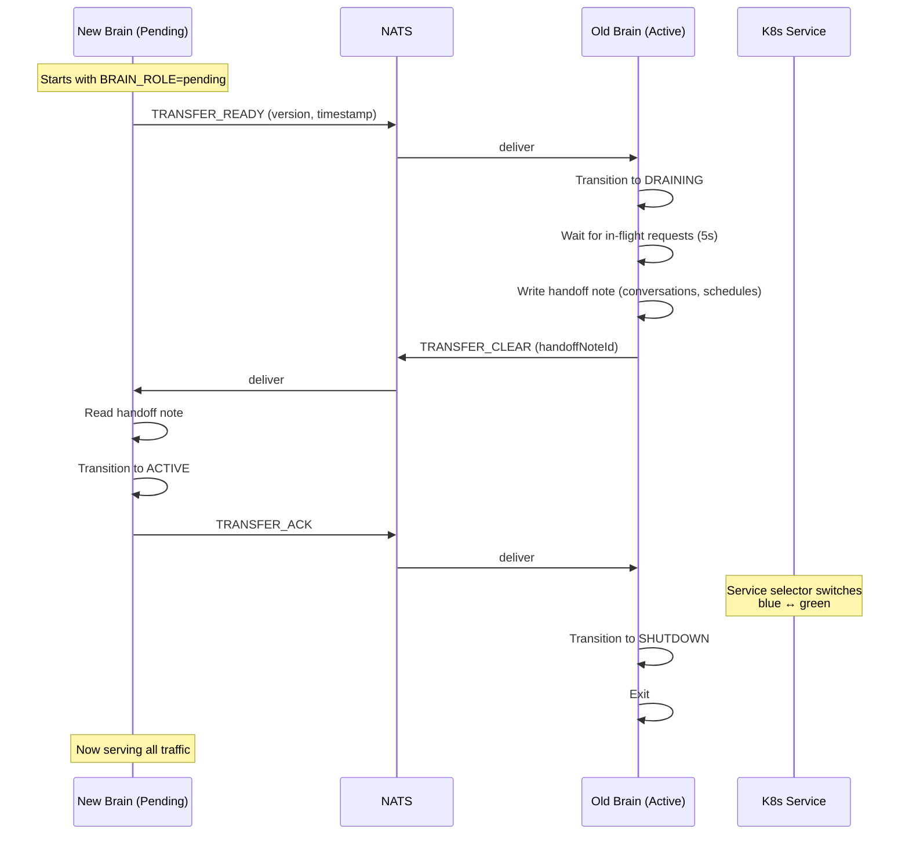

The handoff note preserves continuity — active conversations and enabled schedules transfer seamlessly to the new version. If the new brain fails health checks, the upgrade script automatically rolls back by scaling down the new slot and keeping the old one active.

---

## Observability

The telemetry stack is optional and deploys to a separate `bakerst-telemetry` namespace via Kustomize namespace transformer, keeping it fully isolated from application workloads.

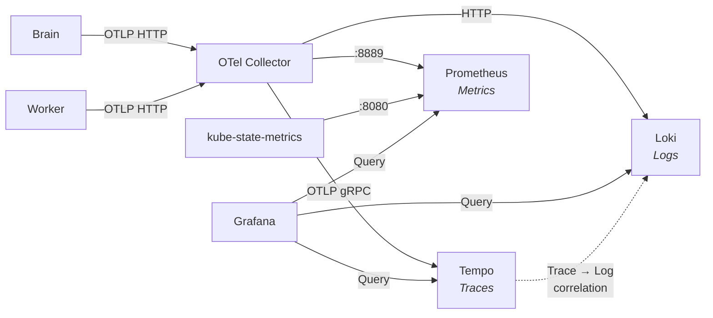

Two Prometheus modes are supported:

| Mode | Description |
|------|-------------|
| **Local** | Prometheus + kube-state-metrics deploy inside the cluster; Prometheus scrapes OTel Collector metrics (`:8889`) and kube-state-metrics (`:8080`); Grafana queries local Prometheus |
| **External** | No local Prometheus; OTel Collector pushes metrics via `prometheusremotewrite` to an external URL; Grafana queries the external Prometheus directly |

Additional details:

- Every API response includes an `X-Trace-Id` header for end-to-end correlation
- Trace context propagates through NATS messages, so a single user request can be traced across brain → NATS → worker
- LLM calls are instrumented as `brain.llm.call` spans with role and iteration metadata
- Tool executions appear as `tool.<name>` child spans
- Cross-namespace network policies allow only the brain and worker to push telemetry into the `bakerst-telemetry` namespace

---

## Quick Start

```bash
# Clone and enter the repository
git clone https://github.com/The-Baker-Street-Project/baker-street.git
cd baker-street

# Interactive deploy — asks for secrets, builds everything, deploys to K8s
scripts/deploy-all.sh

# Open the UI
open http://localhost:30080
```

The deploy script walks through prerequisite checks, secret configuration, TypeScript compilation, Docker image builds, and Kubernetes deployment in a single interactive flow. See `scripts/deploy-all.sh --help` for non-interactive and selective options.

---

## Project Structure

```
bakerst/
├── packages/
│   ├── shared/             # Types, NATS subjects, model router, feature flags
│   └── extension-sdk/      # SDK for building pod-based extensions
├── services/
│   ├── brain/              # Agent orchestrator (Express + Claude + NATS)
│   ├── worker/             # Job execution (NATS consumer + Claude)
│   ├── gateway/            # Telegram & Discord bridge
│   ├── companion/          # Distributed agent daemon (bare metal / VM)
│   └── ui/                 # React SPA (Vite + Tailwind + Caddy)
├── plugins/
│   └── filesystem/         # Sandboxed file access (stdio MCP)
├── examples/
│   ├── extension-github/      # GitHub tools (repos, issues, PRs)
│   ├── extension-obsidian/    # Obsidian vault tools (notes, search, links)
│   └── extension-utilities/   # Time/date and network lookup tools
├── operating_system/       # Personality files (SOUL.md, BRAIN.md, etc.)
├── k8s/                    # Kubernetes manifests (Kustomize)
│   ├── brain/              # Blue-green deployments, RBAC, service
│   ├── worker/
│   ├── ui/
│   ├── gateway/
│   ├── nats/               # JetStream message broker
│   ├── qdrant/             # Vector database
│   ├── task/               # Task pod RBAC (ServiceAccount, zero permissions)
│   ├── telemetry/          # Prometheus, kube-state-metrics, Kustomize namespace transformer
│   ├── otel-collector/     # Trace collection
│   ├── tempo/              # Trace storage
│   ├── loki/               # Log aggregation
│   ├── grafana/            # Dashboards
│   ├── overlays/dev/       # Dev mode patches
│   └── network-policies.yaml
└── scripts/
    ├── deploy-all.sh       # Interactive full deploy
    ├── build.sh            # Docker image builds
    ├── secrets.sh          # K8s secret management
    ├── deploy.sh           # K8s manifest apply
    └── upgrade.sh          # Zero-downtime blue-green upgrade
```
